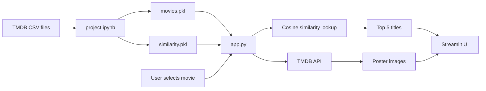

# Movie Recommender System

## Overview

This project is a **content-based movie recommendation system** built on the TMDB 5000 dataset. It suggests movies similar to a user-selected title by comparing textual features such as genres, keywords, cast, crew, and plot overview.

The workflow is split into two parts:

1. **`project.ipynb`** — loads and preprocesses movie data, builds a similarity matrix, and serializes the artifacts.
2. **`app.py`** — a Streamlit web application that loads the saved artifacts and displays the top five recommendations with posters from The Movie Database (TMDB) API.

The repository also contains `main.cpp`, a standalone C++ program unrelated to the recommender pipeline.

## Features

- Content-based recommendations using movie metadata (genres, keywords, cast, crew, overview)
- Interactive Streamlit UI with a searchable movie dropdown
- Top-five similar movie suggestions per selection
- Movie poster images fetched from the TMDB API
- Reproducible offline model build via Jupyter notebook
- Serialized model artifacts (`movies.pkl`, `similarity.pkl`) for fast app startup

## Tech Stack

| Category | Technologies |
|----------|--------------|
| Language | Python 3, C++ |
| Web UI | Streamlit |
| Data processing | pandas, NumPy |
| NLP / ML | scikit-learn (`CountVectorizer`, `cosine_similarity`), NLTK (`PorterStemmer`) |
| Visualization (notebook) | matplotlib, seaborn |
| HTTP | `requests` |
| Serialization | `pickle` |
| External API | [TMDB API](https://developer.themoviedb.org/docs) (posters) |
| Development | Jupyter Notebook |

## Project Structure

```
MLBook/
├── app.py                 # Streamlit movie recommender application
├── project.ipynb          # Data preprocessing, similarity matrix, artifact export
├── main.cpp               # Standalone C++ hello-world program (not used by the app)
├── README.md
├── .gitignore
├── tmdb_5000_movies.csv   # Required dataset (not included in repo)
├── tmdb_5000_credits.csv  # Required dataset (not included in repo)
├── movies.pkl             # Generated movie metadata (gitignored)
└── similarity.pkl         # Generated cosine similarity matrix (gitignored)
```

| File / folder | Description |
|---------------|-------------|
| `project.ipynb` | End-to-end notebook: EDA, feature engineering, vectorization, similarity computation, and pickle export |
| `app.py` | Loads pickles, accepts user input, runs recommendation logic, fetches posters |
| `movies.pkl` | Pickled DataFrame with `id`, `title`, and processed `recommendKeyWords` |
| `similarity.pkl` | Pickled cosine similarity matrix (4806 × 4806 after preprocessing) |
| `.gitignore` | Excludes `*.pkl`, `*.zip`, `__pycache__/`, `.env/`, `.venv/` |

## Installation

### Prerequisites

- Python 3.8+
- pip
- A C++ compiler (only if building `main.cpp`)
- TMDB 5000 CSV files placed in the project root

### Clone the repository

```bash
git clone <repository-url>
cd MLBook
```

### Download the dataset

Place the following files in the project root (they are referenced by `project.ipynb`):

- `tmdb_5000_movies.csv`
- `tmdb_5000_credits.csv`

These files are commonly available as the **TMDB 5000 Movie Dataset** on Kaggle.

### Install Python dependencies

No `requirements.txt` is included. Install the packages used in the project:

```bash
pip install streamlit pandas numpy scikit-learn nltk requests matplotlib seaborn jupyter
```

Download NLTK data if needed (the notebook uses the Porter stemmer from `nltk.stem.porter`):

```bash
python -c "import nltk; nltk.download('punkt')"
```

### Build model artifacts

Run all cells in `project.ipynb`. This creates:

- `movies.pkl`
- `similarity.pkl`

Both files must exist before starting the Streamlit app.

## Running the Project

### Streamlit application (primary workflow)

```bash
streamlit run app.py
```

Open the URL shown in the terminal (typically `http://localhost:8501`).

### Jupyter notebook (model training)

```bash
jupyter notebook project.ipynb
```

Execute cells sequentially to regenerate the pickle files.

### C++ program (optional, standalone)

```bash
g++ main.cpp -o main
./main        # Linux / macOS
main.exe      # Windows
```

Prints `navya` to stdout. This program is not part of the recommender system.

## Usage

1. Ensure `movies.pkl` and `similarity.pkl` are in the project root.
2. Start the app with `streamlit run app.py`.
3. Select a movie from the **Select the movie** dropdown.
4. Click **Recommend**.
5. The app displays the top five similar movies with titles and poster images.

Recommendations are based on cosine similarity of bag-of-words vectors derived from each movie's combined metadata text.

## How It Works



1. **Data merge** — `tmdb_5000_movies.csv` and `tmdb_5000_credits.csv` are merged on `title`.
2. **Cleaning** — Missing values are dropped; duplicate rows are removed (4,806 movies remain).
3. **Feature text** — Genres, keywords, top-three cast names, crew names (where `job == "Director of Photography"`), and tokenized overview are combined into a single `recommendKeyWords` string per movie.
4. **Vectorization** — `CountVectorizer` (`max_features=5000`, `stop_words="english"`) converts text to sparse count vectors.
5. **Similarity** — Pairwise **cosine similarity** is computed across all movies.
6. **Persistence** — The processed DataFrame and similarity matrix are saved as pickle files.
7. **Inference** — `app.py` loads the pickles, finds the selected movie's index, sorts similarity scores, and returns the top five matches (excluding the query movie itself).
8. **Posters** — For each recommended movie `id`, the app calls the TMDB movie details endpoint and displays the poster URL.

## Models / Algorithms

### Dataset

| File | Rows (raw) | Description |
|------|------------|-------------|
| `tmdb_5000_movies.csv` | 4,803 | Movie metadata: budget, genres, keywords, overview, popularity, etc. |
| `tmdb_5000_credits.csv` | 4,804 | Cast and crew JSON for each movie |

After merge, drop-null, and deduplication: **4,806 movies**.

### Data preprocessing

- Merge movies and credits on `title`
- Retain columns: `genres`, `id`, `keywords`, `overview`, `popularity`, `title`, `cast`, `vote_average`, `vote_count`, `crew`
- Drop rows with missing values (`overview` had 3 nulls)
- Remove duplicate rows
- Parse JSON-like string fields with `ast.literal_eval`
- Extract **top 3 cast** member names per movie
- Extract crew members with job **"Director of Photography"**
- Tokenize `overview` by splitting on whitespace
- Remove spaces inside multi-word genre/cast/crew tokens (e.g., `Science Fiction` → `ScienceFiction`)

### Feature engineering

All signals are concatenated into one text field per movie:

```
recommendKeyWords = genres + keywords + cast + crew + overview
```

Additional steps:

- Join token lists into a single space-separated string
- Convert to lowercase
- Apply **Porter stemming** via NLTK

### Model architecture

This is not a neural network. The "model" is:

1. **Bag-of-words** representation via `CountVectorizer` (vocabulary capped at 5,000 features)
2. **Cosine similarity matrix** over all movie vectors (shape: 4,806 × 4,806)

### Training process

There is no supervised train/test split. The notebook:

1. Fits `CountVectorizer` on all `recommendKeyWords` strings
2. Transforms text to a document-term matrix
3. Computes the full cosine similarity matrix once
4. Serializes results to disk

Re-running the notebook overwrites `movies.pkl` and `similarity.pkl`.

### Evaluation metrics

No formal evaluation (accuracy, precision, recall, RMSE, etc.) is implemented in the codebase. Recommendation quality is assessed informally through manual inspection in the notebook (e.g., testing with *Pirates of the Caribbean: At World's End*).

### Results

Example output from the notebook's `recommend()` function for *Pirates of the Caribbean: At World's End*:

| Rank | Recommended title |
|------|-------------------|
| 1 | Pirates of the Caribbean: Dead Man's Chest |
| 2 | Pirates of the Caribbean: The Curse of the Black Pearl |
| 3 | Pirates of the Caribbean: On Stranger Tides |
| 4 | The Indian in the Cupboard |
| 5 | Life of Pi |

The first three results are other films in the same franchise, which indicates the content-based approach captures shared cast, genre, and keyword patterns.

### Limitations

- **Content-based only** — no collaborative filtering or user rating history
- **No held-out evaluation** — similarity is computed on the full catalog with no metric reporting
- **Title-based merge** — merging on `title` can misalign rows when titles collide
- **Crew feature scope** — only "Director of Photography" credits are used, not directors or other roles
- **Cold start** — new movies not in the dataset cannot be recommended
- **Hardcoded API key** — TMDB key is embedded in `app.py`
- **Missing artifacts in repo** — CSV and pickle files must be obtained or generated locally
- **UI layout** — `app.py` assigns all five recommendation columns to `col1`, so posters may not render in separate columns as intended

## Configuration

| Item | Location | Notes |
|------|----------|-------|
| TMDB API key | `app.py` (`fetchPoster`) | Used to fetch poster paths; currently hardcoded |
| Pickle artifacts | Project root | `movies.pkl`, `similarity.pkl` required by the app |
| Dataset files | Project root | `tmdb_5000_movies.csv`, `tmdb_5000_credits.csv` required by the notebook |
| Vectorizer settings | `project.ipynb` | `max_features=5000`, `stop_words="english"` |
| Recommendation count | `app.py`, notebook | Top **5** similar movies (index 0 excluded as the query movie) |

For production use, move the TMDB API key to an environment variable and load it in `app.py` instead of hardcoding it.

## Future Improvements

- Add a `requirements.txt` (or `pyproject.toml`) with pinned dependency versions
- Externalize the TMDB API key via environment variables (`.env`)
- Fix Streamlit column assignment so each recommendation uses `col1`–`col5`
- Expand crew extraction to include directors and other key roles
- Add collaborative filtering or hybrid recommendations using `vote_average` / `vote_count`
- Implement evaluation metrics (e.g., precision@k on a labeled or manual test set)
- Handle duplicate movie titles during the merge step
- Add dataset download instructions or a setup script
- Remove or relocate `main.cpp` if it is not part of the project scope
- Add error handling for missing posters or TMDB API failures

## Contributing

1. Fork the repository and create a feature branch from `main`.
2. Set up a virtual environment and install the dependencies listed in **Installation**.
3. Place the TMDB 5000 CSV files in the project root and run `project.ipynb` to generate artifacts.
4. Make focused changes with clear commit messages.
5. Test the notebook pipeline and `streamlit run app.py` before opening a pull request.
6. Do not commit `*.pkl`, API keys, or local virtual environment directories.

Pull requests that include reproducible setup steps and avoid hardcoded secrets are especially welcome.
